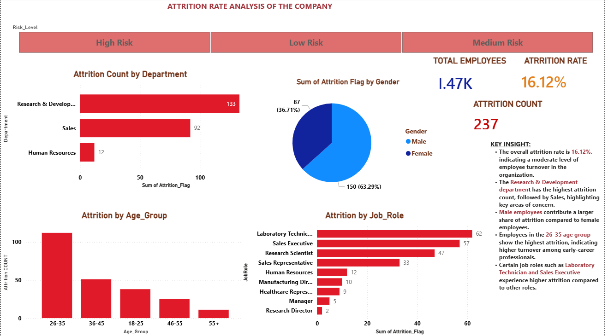

# Employee Attrition Analysis and Prediction Dashboard

## Overview

This project presents an interactive Power BI dashboard developed to analyze employee attrition and identify the key factors influencing workforce turnover. The dashboard also highlights high-risk employee segments using data-driven insights to support effective decision-making.

## Objective

* Analyze patterns of employee attrition
* Identify high-risk employee groups
* Provide actionable insights to improve employee retention

## Dataset

* IBM HR Analytics Employee Attrition Dataset
* 1470 employee records
* 35 attributes

## Tools Used

* Microsoft Power BI
* Microsoft Excel

## Dashboard Structure

### Page 1: Attrition Overview Dashboard

This page provides a high-level summary of employee attrition across the organization.

Key Metrics:

* Total Employees: 1470
* Attrition Count: 237
* Attrition Rate: 16.12%

Analysis:

* Attrition is highest in the Research & Development and Sales departments
* Male employees contribute a larger proportion of attrition
* The 26–35 age group shows the highest employee turnover
* Job roles such as Laboratory Technician and Sales Executive experience higher attrition

---

### Page 2: Risk and Predictive Analysis Dashboard

This page focuses on identifying high-risk employees and analyzing the factors that contribute to attrition.

Analysis:

* Employees are categorized into High, Medium, and Low risk groups
* Employees working overtime show higher attrition levels
* Lower job satisfaction is associated with increased attrition
* Employees in lower salary ranges exhibit higher turnover
* Employees with shorter tenure are more likely to leave

---

## Key Insights

* The overall attrition rate is 16.12%, indicating a moderate level of employee turnover
* The Sales department has the highest attrition rate, indicating higher relative risk
* Early-career employees in the 26–35 age group are more likely to leave
* Overtime significantly increases the likelihood of attrition
* Job satisfaction is a critical factor influencing employee retention
* Lower salary groups show higher attrition trends

---

## Business Recommendations

* Improve work-life balance by reducing excessive overtime
* Strengthen employee engagement and satisfaction initiatives
* Focus on retention strategies for early-career employees
* Review and optimize compensation structures
* Identify and monitor high-risk employees proactively

---

## Dashboard Preview

### Attrition Overview

### Risk and Predictive Analysis

---

## Future Enhancements

* Integrate machine learning models for attrition prediction
* Enable real-time data integration for continuous monitoring
* Automate HR analytics workflows

---

## Conclusion

This project demonstrates the application of business intelligence techniques to analyze employee attrition and support data-driven HR decisions. The dashboard enables organizations to identify patterns, understand key drivers of attrition, and implement effective retention strategies.

---
